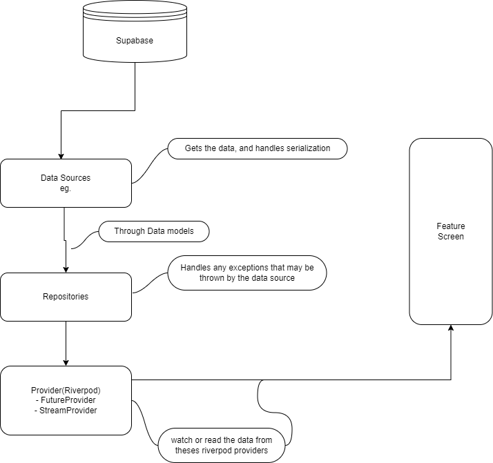

# EESUp - Code Base Architecture
### Brief Decsription of the Project
###### Structure of a typical  Api Call to fetch data with riverpod

##### Simple enough😜

#### Contribution Guidelines 👨🏾‍💻👩🏽‍💻

- Clone the repository 🦁🦁💪🏻
- Create a new branch
- Make your changes
- Write & Run the tests ✅
- Commit your changes
- Push to the branch
- Create a pull request
- Wait for review
